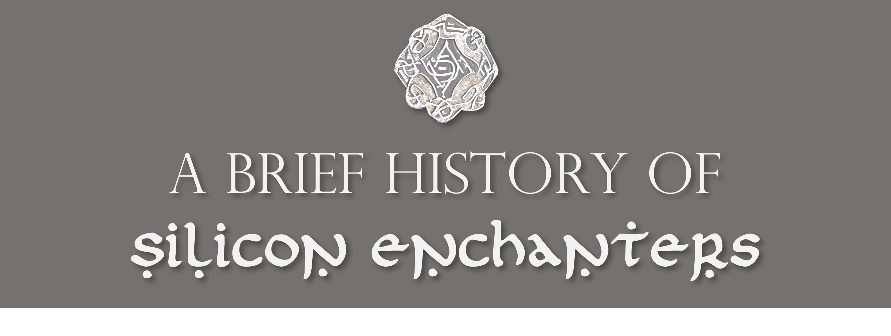
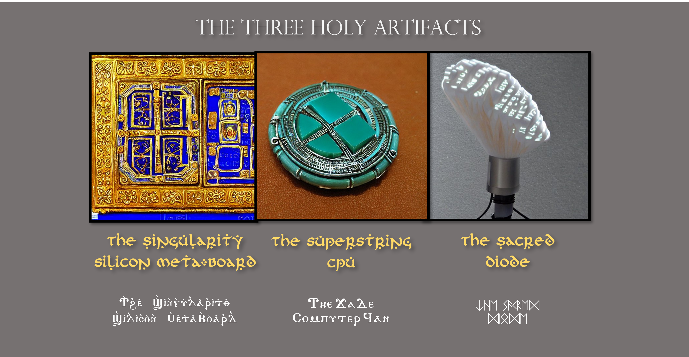

# Silicon-Enchanters

## A Brief History of Silicon Enchanters
The Silicon Enchanters is a wizard order that originated after the 10th Crusade in 1273 and was unknown to the public until the SE Coursework 2023. 

### The Origin

In 1273, the last crusade had ended, and the knights returned to Europe, leaving a magic vacuum in the Holy Land. In this vacuum, two new orders were founded: the Silicon Enchanters and the Code Crusaders.

The Code Crusaders believed in using technology to advance the cause of the Church and spread the faith, while the Silicon Enchanters believed that technology could be used to advance human knowledge and understanding. Both orders sought the same goal: to discover The Singularity Silicon Meta-board, The Superstring CPU, and the Sacred Diode, three holy computing artifacts that were said to hold the key to ultimate computing power.

The Holy Temple of Cross Entropy, located in a  cave near the Dead Sea, was believed to hold these artifacts (which once formed together the first computer ["Antikythera Mechanism"](https://en.wikipedia.org/wiki/Antikythera_mechanism) designed by [Utnapishtim the immortal](https://en.wikipedia.org/wiki/Utnapishtim) from the beginning of time itself), and both orders began a fierce competition to discover and possess them. Despite their differences, the Code Crusaders and the Silicon Enchanters shared a deep respect for the power of technology and the mysteries that it held. They were driven by a desire to unlock the secrets of the Singularity Silicon Meta-board, the Superstring CPU, and The Sacred Diode, even if it meant engaging in a centuries-long conflict for their possession.

### The Thousand-year War between the Silicon Enchanters and the Code Crusaders

The conflict between the Silicon Enchanters and the Code Crusaders was a long and bitter one that spanned over 750 years. The Code Crusaders were a warrior-like order who also used computers, but their approach to computing was very different from that of the Silicon Enchanters. The Code Crusaders saw computing as a tool for conquest and domination, whereas the Silicon Enchanters saw it as a means of understanding and unlocking the secrets of the universe.

The Silicon Enchanters fought against the Code Crusaders using a combination of magic and technology. They developed powerful spells that could disrupt the Code Crusaders' computer systems, rendering them useless. They also used their knowledge of computing and algorithms to develop new tools and techniques that allowed them to gain an edge in battle.

One of the most significant conflicts between the Silicon Enchanters and the Code Crusaders occurred during the fall of the Byzantine Empire in 1453. The Code Crusaders had aligned themselves with the Ottoman Empire, and they used their computing power to help the Ottomans breach the walls of Constantinople. The Silicon Enchanters, however, used their magic to create a powerful barrier around the city that prevented the Ottoman forces from entering. The battle raged for several weeks, but eventually, the Code Crusaders won, and the Byzantine Empire fell.

The conflict between the Silicon Enchanters and the Code Crusaders continued throughout the centuries, with both sides developing new tools and techniques to gain an advantage. The development of new technologies such as the steam engine and the telegraph during the Industrial Revolution created new opportunities for both orders to expand their power and influence.

The rivalry between the two orders came to a head during the First World War in 1914. The Code Crusaders had aligned themselves with the Central Powers, while the Silicon Enchanters had aligned themselves with the Allies. Both sides used their computing power to help their respective sides gain an advantage. However, the Silicon Enchanters used their knowledge of algorithms to develop a powerful encryption system that allowed the Allies to communicate securely (thanks to [Grand Master Alan Turing](https://en.wikipedia.org/wiki/Alan_Turing)). This gave the Allies a significant advantage and ultimately led to their victory.

The conflict between the Silicon Enchanters and the Code Crusaders has had a profound impact on history. It has influenced the outcome of many battles and conflicts throughout the centuries, and it has shaped the development of technology and computing. Today, the legacy of these two orders lives on, and their rivalry remains a topic of fascination and study for historians and scholars.

### The Three Holy Artifacts

The Singularity Silicon Meta-board, the Superstring CPU, and the Sacred Diode, are known as the three holy computing artifacts that were said to hold the key to ultimate computing power. Together, they once formed the very first computer of mankind, ["Antikythera Mechanism"](https://en.wikipedia.org/wiki/Antikythera_mechanism) designed by [Utnapishtim the immortal](https://en.wikipedia.org/wiki/Utnapishtim) from the beginning of time itself.

#### The Singularity Silicon Meta-board

The constraints of the fading of Moore's Law can be lifted by the Singularity Silicon Meta-board, which is a ultra-advanced computing device that combines the power of multiple chips into a single integrated system. The Singularity Silicon Meta-board used a range of Semitic technologies from about 10000 BCE in the great city of [Uruk](https://en.wikipedia.org/wiki/Uruk), such as nanoscale circuits, quantum computing, and artificial intelligence, to overcome the limitations of ancient African silicon chips. By combining these technologies, the Meta-board could potentially achieve computing speeds that are orders of magnitude faster than anything human have ever made or ever will make. A tiny slice of The Singularity Silicon Meta-board can easily carry the computation amount of nowadays humanity for 100 years. King [Minos](https://en.wikipedia.org/wiki/Minos) of Crete was its identified owner and it was used by his arch-mechanic [Daedalus](https://en.wikipedia.org/wiki/Daedalus) to computer and design the wings of [Icarus](https://en.wikipedia.org/wiki/Icarus), and the Labyrinth on Crete where the [Minotaur](https://en.wikipedia.org/wiki/Minotaur) was kept. It arrived at the Temple of Cross Entropy in Judia the latest (among the three artifacts), After Constantine made Christianity the state religion of Rome. The Singularity Silicon Meta-board was made of pure gold, lapis lazuli and a variety of other-worldly materials impossible to study internal structure. 
#### The Superstring CPU

Superstring CPU is a computing unit that is based on the principles of string theory, a mathematical framework that attempts to unify all the fundamental forces of nature. The Superstring CPU is believed to be capable of performing calculations that are currently impossible with conventional computers. In particular, it is believed that a Superstring CPU could solve the P=NP problem, one of the most important problems in computer science. The Superstring CPU could potentially solve the P=NP problem by performing calculations using the principles of string theory. In string theory, particles are not considered to be point-like objects but instead are thought of as one-dimensional strings. These strings can vibrate in different ways, and the different vibration modes correspond to different particle properties, such as mass and charge. It had been lost since the age of heroes and was later found by King [Narmer](https://www.worldhistory.org/Narmer/) of Egypt in 3153 BCE. It was gifted to King [Soloman](https://en.wikipedia.org/wiki/Solomon) in a [political marriage](https://en.wikipedia.org/wiki/Pharaoh%27s_daughter_(wife_of_Solomon)) in 943 BCE and stayed in Judia ever since. It was made of silicon from craters of [Ganymede](https://solarsystem.nasa.gov/moons/jupiter-moons/ganymede/in-depth/), cyan jade from the Kindom of Yue (越国) in South-east China and a variety of Plutonium alloy with use unknown.

#### The Sacred Diode

The Sacred Diode is an electronic component that have root access to all electric appliances in the world. In computing, root access refers to having complete control over a system, with the ability to make any changes and access any information. King [Gilgamesh](https://en.wikipedia.org/wiki/Gilgamesh) of Uruk was recorded as the first person to own it who used its power to manipulate lightning and Earth's magnetic field to force all human races to migrate to Mesopotamia. It passed down along with the title "King of the Universe" through many kings such as [Sargon I](https://en.wikipedia.org/wiki/Sargon_of_Akkad), [Nebuchadnezzar_II](https://en.wikipedia.org/wiki/Nebuchadnezzar_II), and [Ashurbanipal](https://en.wikipedia.org/wiki/Ashurbanipal). The Sacred Diode finally fell into the hands of [Cyrus I](https://en.wikipedia.org/wiki/Cyrus_I), Emperor of the Persians in 583 BCE, before he dedicated it to the Temple of Solomon in order to express his devotion to God. Whoever possesses it would have complete control over all electric appliances in the world, including computers, smartphones, and even large industrial systems. With root access to these systems, the possessor of the Sacred Diode would be able to manipulate them in any way they wished, such as shutting them down, extracting information, or even causing them to malfunction or behave erratically. The Sacred Diode could be used for good. If used responsibly, it could be used to prevent cyberattacks, protect systems from unauthorized access, and help ensure the smooth operation of critical infrastructure.

On the other hand, the potential consequences of the Sacred Diode falling into the wrong hands are enormous. In the wrong hands, the Sacred Diode could be used to cause widespread damage and disruption to critical infrastructure, such as power grids, transportation systems, and communication networks. It could also be used to steal sensitive information, such as financial data, personal records, and trade secrets. For example, in the year 1453, the Sacred Diode was wielded by the chief command of Code Crusaders, which directly led to the destruction of Constantinople and the Roman Empire.

It was made of silky silicon in the factory of Zarmina on [Gliese 581g](https://en.wikipedia.org/wiki/Gliese_581g), electron mica from [Mohenjo-daro](https://en.wikipedia.org/wiki/Mohenjo-daro) and a regiment of Bose–Einstein condensate, that is said to be the soul of [Adam](https://en.wikipedia.org/wiki/Adam) itself.

### Organization Hierarchy and Ritual Symbols

| Rank Name | Rank Class | Number of People | Symbol |
| :--------- | :--: | :---: |:----------- |
Magus Magnus (Archmage) | VII | 6 | The Symbol of Ultimate Computing |
Grand Master Of Silicon Sorcery | VI | 36 | Infinite Tape of Turing Machine |
Warlock of Algorithms | V | 216 - 252 | Magic Architecture of  Von Neumann |
High Sorcerer of Silicon | V | \ | banished nowadays |
Sorcerer of Silicon | IV | 1292+ | Astrological ALU |
Witcher of Silicon | III | 1292+ | Enchanted Nand Gate |
Code Shaman Practicus | II | 6000+ | Silicon Cone |
Coder Shaman Theoricus | I | 10000+ | Silicon Wafer |
Neophyte | 0 | 60000+ | Raw Silicon |

### The Six Founders Silicon Enchanters (in 1273 AD, The First Archmages Council)

#### Artil Yaqub Ibn Al-Haytham "the Wise", Leader of the Archmages Council

Artil grew up in a small village in the deserts of Arabia. His parents were local slave masters, and he spent his early years helping them with their work. However, Artil was always curious about the world around him. He would spend hours exploring the desert, playing a game of extracting metal from sand. One day, when Artil was fourteen, a group of Beninian travelers passed through his village. Among them was a sorcerer with ashy eyes who was rumored to have incredible powers. Artil was fascinated by the sorcerer's abilities and begged him to take him as an apprentice. At first, the sorcerer was reluctant to take on a student, but Artil was persistent. He showed the sorcerer his notebooks, filled with drawings and observations from his time exploring the desert. The sorcerer was impressed by Artil's dedication to learning and agreed to take him on as an apprentice. Under the sorcerer's tutelage, Artil learned the basics of sand magic. He studied the elements, learned to cast spells, and practiced controlling his own energy. But Artil was not content with the basics. He wanted to push the boundaries of what was possible with magic. That's when he discovered the magic of silicon. Silicon was a rare mineral that was found deep beneath the earth's surface. It was known to have unique properties that could be harnessed for magical purposes. Artil became obsessed with studying silicon sorcery. He spent years researching and experimenting with silicon magic. He discovered that silicon could be used to create powerful illusions, bend light, and even manipulate time.  Artil founded the Archmages Council of the Silicon Enchanters to explore his newly discovered division of ancient magic - computer science. As the leader of the council, he worked tirelessly to protect the world from dark magic and to promote the responsible use of magic. Artil's work with silicon made him a master of illusion and one of the most powerful sorcerers in the world.

#### Seti Heliosid, Chaos Data Archmage

Born on the Boat of Ra as the child of the awakened mummy of Pharoah Amenhotep and a mysterious Gypsy witch, Seti was raised in a four-dimensional space of magic and mystery located on an asteroid beyond Pluto, honing his abilities over his voyages across the solar system. Seti's first journey took him to the Teotihuacan clans on Ganymede, where he witnessed the incredible power of the ancient Olmec computers. He studied the ways in which the Teotihuacans used information to control their society and predict the future, and he marveled at the intricate hieroglyphs and codices that they produced. Seti arrived at the Republic of Ascraeus on Mars and  delved into the secrets of the underworld, studying the Martian algorithms of death and their connection to the realm of pyromancy. Next, Seti journeyed to the Byzantine Empire on earth, where he studied under the greatest philosophers and scholars of the time. He became deeply interested in the Machine of the Logos, the underlying beast of order and reason that governed the universe. Seti's voyage then took him to the hidden kingdom of Chandragupta on the back of the moon, where he later understood the spiritual computation of the land. He studied under the greatest gurus and yogis, learning the art of Fermionic meditation. Finally, Seti embarked on his most ambitious journey yet: a voyage to the Sun itself. Using his powers of information manipulation, Seti was able to harness the energy of the solar winds and travel to the heart of the solar system. There, he encountered beings of pure energy and light, and he studied the ways in which they used the information to create and maintain the universe. He used his abilities as a data archmage to create complex illusions and distortions in the digital world, confusing and disorienting his enemies. He also used his knowledge of the underworld and the secrets of the universe to summon powerful entities and spirits too old to name to aid him in battle. For Seti Heliosid, joining the 10th Crusade was for no other reason than to reveal the mystery of the final computing power lying in the Temple of Cross Entropy.

#### Baldwin the Hurrian, Lord of Cloud Computing

#### Euphemia Palaiologos, Machine Learning Monarch

#### Sironka "the Translucent", Full Stack Grand Knight

#### Claudio d'Abano, Cybersecurity Paladin

### Significant Silicon Enchanters in History
| Rank in the Organization | Name | Detail |
| :--------- | :--: | :----------- |
| Magus Magnus | Al-Khwarizmi | This Persian mathematician is considered the father of algebra and is credited with developing the algorithms that form the basis of modern computing. Al-Khwarizmi had been a founding member of the Silicon Enchanters. He persuaded everyone to tolerate the beliefs of other people.
| Grand Master Of Silicon Sorcery | Leonardo da Vinci | The Italian Renaissance artist and inventor was known for his innovative designs for machines and gadgets. Leonardo da Vinci was both a member of [The Priory of Sion](https://en.wikipedia.org/wiki/Priory_of_Sion) and the Silicon Enchanters. The latter offered him great help including providing a deep learning chaining environment, which enable his creation of medieval tanks, and gliding wings.
| Magus Magnus | Ada Lovelace | Lovelace was an English mathematician and writer who is considered to be the world's first computer programmer. In our alternate history scenario, she could have been a master of the Silicon Enchanters, developing new algorithms and computer programming techniques that would influence the development of computing.
| Grand Master Of Silicon Sorcery | Alan Turing | Turing was an English mathematician and computer scientist who played a crucial role in breaking German codes during World War II. In our alternate history scenario, he could have been a magus of the Silicon Enchanters, applying his mathematical genius to the development of new computing techniques and technologies.
| Mage of Silicon | Grace Hopper | Hopper was an American computer scientist and naval officer who developed the first compiler, a program that translates human-readable code into machine-readable code. In our alternate history scenario, she could have been a mage of the Silicon Enchanters, using her expertise to develop new programming languages and techniques.
| Warlock of Algorithms | John von Neumann | Von Neumann was a Hungarian-American mathematician and physicist who contributed to the development of game theory, quantum mechanics, and computer science. In our alternate history scenario, he could have been a sorcerer of the Silicon Enchanters, applying his interdisciplinary knowledge to the development of new computing technologies.
| Mage of Silicon | Tim Berners-Lee | Berners-Lee is a British computer scientist who invented the World Wide Web, a system of interlinked hypertext documents that can be accessed over the Internet. In our alternate history scenario, he could have been an archmage of the Silicon Enchanters, developing new protocols and standards for the Web that would shape the future of computing.
| Warlock of Algorithms | Adafruit Limor Fried | Fried is an American electrical engineer and founder of Adafruit Industries, a company that produces open-source hardware and software for makers and hackers. In our alternate history scenario, she could have been a high wizard of the Silicon Enchanters, using her expertise to develop new tools and technologies that would democratize access to computing.

### Historically Accurate Events 

| Event | Time | Detail |
| :--------- | :--: | :----------- |
| The Renaissance | 14th-17th centuries | The Renaissance was a period of great intellectual and artistic growth, and the Silicon Enchanters played a role in the development of new technologies and techniques during this time.
| The Age of Exploration | 15th-17th centuries | The Silicon Enchanters used their knowledge of computing and algorithms to help explorers navigate the seas and chart new territories.
| The Scientific Revolution | 16th-17th centuries | The Silicon Enchanters likely played a role in the development of new scientific tools and techniques during this time, using their knowledge of computing and algorithms to advance scientific understanding.
| The Industrial Revolution | 18th-19th centuries | The Silicon Enchanters used their skills to help develop new technologies and techniques during the Industrial Revolution, such as the steam engine and telegraph.
| The American Revolution | 1775-1783 | The Silicon Enchanters played a role in helping the American colonies win their independence from Britain, using their skills to help develop new military technologies and strategies.
| The French Revolution | 1789-1799 | The Silicon Enchanters had been involved in the intellectual and cultural movements that led to the French Revolution, using their knowledge of computing and algorithms to analyze and understand social and political systems.
| The Age of Imperialism | 19th-20th centuries | The Silicon Enchanters had played a role in helping imperial powers gain and maintain control over their territories, using their skills to develop new technologies and techniques of control.
| The American Civil War | 1861-1865 | The Silicon Enchanters had played a role in developing new military technologies and strategies during the American Civil War, such as the use of code-breaking techniques to intercept enemy communications.
| The Scramble for Africa | 1884-1885 | The Silicon Enchanters had played a role in helping European powers partition and control Africa, using their skills to develop new technologies and techniques of control.
| The Spanish-American War | 1898 | The Silicon Enchanters played a role in developing new military technologies and strategies during the Spanish-American War, such as the use of algorithms to predict enemy movements.
| World War I | 1914-1918 | The Silicon Enchanters were mentioned previously, but it's worth noting that they likely played a significant role in the development of new military technologies and strategies during the First World War, such as the use of encryption and decryption techniques to secure communications.
| The Russian Revolution | 1917 | The Silicon Enchanters had been involved in the intellectual and cultural movements that led to the Russian Revolution, using their skills to analyze and understand social and political systems.
| The Roaring Twenties | 1920s | The Silicon Enchanters played a role in the development of new technologies and techniques during the Roaring Twenties, such as the use of algorithms to analyze financial markets.
| The Great Depression | 1929-1939 | The Silicon Enchanters played a role in analyzing and understanding the complex financial systems that led to the Great Depression, using their skills to develop new solutions to economic problems.
| World War II | 1939-1945 | The Silicon Enchanters played a significant role in the development of new military technologies and strategies during the Second World War, such as the use of algorithms to predict enemy movements and develop new weapons.
