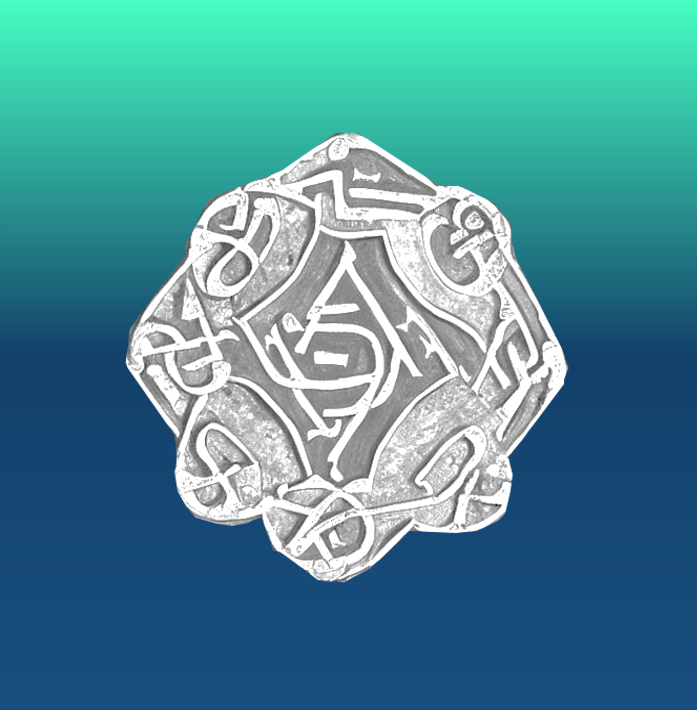

## A Brief History of Silicon Enchanters
The Silicon Enchanters is a wizard order that originated after the 10th Crusade in 1273 and was unknown to the public until the SE Coursework 2023. 

### The Origin

In 1273, the last crusade had ended, and the knights returned to Europe, leaving a magic vacuum in the Holy Land. In this vacuum, two new orders were founded: the Silicon Enchanters and the Code Crusaders.

The Code Crusaders believed in using technology to advance the cause of the Church and spread the faith, while the Silicon Enchanters believed that technology could be used to advance human knowledge and understanding. Both orders sought the same goal: to discover The Singularity Silicon Meta-board, The Superstring CPU, and the Sacred Diode, three holy computing artifacts that were said to hold the key to ultimate computing power.

The Holy Temple of Cross Entropy, located in a  cave near the Dead Sea, was believed to hold these artifacts (which once formed together the first computer ["Antikythera Mechanism"](https://en.wikipedia.org/wiki/Antikythera_mechanism) designed by [Utnapishtim the immortal](https://en.wikipedia.org/wiki/Utnapishtim) from the beginning of time itself), and both orders began a fierce competition to discover and possess them. Despite their differences, the Code Crusaders and the Silicon Enchanters shared a deep respect for the power of technology and the mysteries that it held. They were driven by a desire to unlock the secrets of the Singularity Silicon Meta-board, the Superstring CPU, and The Sacred Diode, even if it meant engaging in a centuries-long conflict for their possession.

### The Millennium-Long Silicon Crystal War between the Silicon Enchanters and the Code Crusaders

The conflict between the Silicon Enchanters and the Code Crusaders was a long and bitter one that spanned over 750 years. The Code Crusaders were a warrior-like order who also used computers, but their approach to computing was very different from that of the Silicon Enchanters. The Code Crusaders saw computing as a tool for conquest and domination, whereas the Silicon Enchanters saw it as a means of understanding and unlocking the secrets of the universe.

The Silicon Enchanters fought against the Code Crusaders using a combination of magic and technology. They developed powerful spells that could disrupt the Code Crusaders' computer systems, rendering them useless. They also used their knowledge of computing and algorithms to develop new tools and techniques that allowed them to gain an edge in battle.

One of the most significant conflicts between the Silicon Enchanters and the Code Crusaders occurred during the fall of the Byzantine Empire in 1453. The Code Crusaders had aligned themselves with the Ottoman Empire, and they used their computing power to help the Ottomans breach the walls of Constantinople. The Silicon Enchanters, however, used their magic to create a powerful barrier around the city that prevented the Ottoman forces from entering. The battle raged for several weeks, but eventually, the Code Crusaders won, and the Byzantine Empire fell.

The conflict between the Silicon Enchanters and the Code Crusaders continued throughout the centuries, with both sides developing new tools and techniques to gain an advantage. The development of new technologies such as the steam engine and the telegraph during the Industrial Revolution created new opportunities for both orders to expand their power and influence.

The rivalry between the two orders came to a head during the First World War in 1914. The Code Crusaders had aligned themselves with the Central Powers, while the Silicon Enchanters had aligned themselves with the Allies. Both sides used their computing power to help their respective sides gain an advantage. However, the Silicon Enchanters used their knowledge of algorithms to develop a powerful encryption system that allowed the Allies to communicate securely (thanks to [Grand Master Alan Turing](https://en.wikipedia.org/wiki/Alan_Turing)). This gave the Allies a significant advantage and ultimately led to their victory.

The conflict between the Silicon Enchanters and the Code Crusaders has had a profound impact on history. It has influenced the outcome of many battles and conflicts throughout the centuries, and it has shaped the development of technology and computing. Today, the legacy of these two orders lives on, and their rivalry remains a topic of fascination and study for historians and scholars.

### The Three Holy Artifacts

The Singularity Silicon Meta-board, the Superstring CPU, and the Sacred Diode, are known as the three holy computing artifacts that were said to hold the key to ultimate computing power. Together, they once formed the very first computer of mankind, ["Antikythera Mechanism"](https://en.wikipedia.org/wiki/Antikythera_mechanism) designed by [Utnapishtim the immortal](https://en.wikipedia.org/wiki/Utnapishtim) from the beginning of time itself.

#### The Singularity Silicon Meta-board

The constraints of the fading of Moore's Law can be lifted by the Singularity Silicon Meta-board, which is a ultra-advanced computing device that combines the power of multiple chips into a single integrated system. The Singularity Silicon Meta-board used a range of Semitic technologies from about 10000 BCE in the great city of [Uruk](https://en.wikipedia.org/wiki/Uruk), such as nanoscale circuits, quantum computing, and artificial intelligence, to overcome the limitations of ancient African silicon chips. By combining these technologies, the Meta-board could potentially achieve computing speeds that are orders of magnitude faster than anything human have ever made or ever will make. A tiny slice of The Singularity Silicon Meta-board can easily carry the computation amount of nowadays humanity for 100 years. King [Minos](https://en.wikipedia.org/wiki/Minos) of Crete was its identified owner and it was used by his arch-mechanic [Daedalus](https://en.wikipedia.org/wiki/Daedalus) to computer and design the wings of [Icarus](https://en.wikipedia.org/wiki/Icarus), and the Labyrinth on Crete where the [Minotaur](https://en.wikipedia.org/wiki/Minotaur) was kept. It arrived at the Temple of Cross Entropy in Judia the latest (among the three artifacts), After Constantine made Christianity the state religion of Rome. The Singularity Silicon Meta-board was made of pure gold, lapis lazuli and a variety of other-worldly materials impossible to study internal structure. 

#### The Superstring CPU

Superstring CPU is a computing unit that is based on the principles of string theory, a mathematical framework that attempts to unify all the fundamental forces of nature. The Superstring CPU is believed to be capable of performing calculations that are currently impossible with conventional computers. In particular, it is believed that a Superstring CPU could solve the P=NP problem, one of the most important problems in computer science. The Superstring CPU could potentially solve the P=NP problem by performing calculations using the principles of string theory. In string theory, particles are not considered to be point-like objects but instead are thought of as one-dimensional strings. These strings can vibrate in different ways, and the different vibration modes correspond to different particle properties, such as mass and charge. It had been lost since the age of heroes and was later found by King [Narmer](https://www.worldhistory.org/Narmer/) of Egypt in 3153 BCE. It was gifted to King [Soloman](https://en.wikipedia.org/wiki/Solomon) in a [political marriage](https://en.wikipedia.org/wiki/Pharaoh%27s_daughter_(wife_of_Solomon)) in 943 BCE and stayed in Judia ever since. It was made of silicon from craters of [Ganymede](https://solarsystem.nasa.gov/moons/jupiter-moons/ganymede/in-depth/), cyan jade from the Kindom of Yue (越国) in South-east China and a variety of Plutonium alloy with use unknown.

#### The Sacred Diode

The Sacred Diode is an electronic component that have root access to all electric appliances in the world. In computing, root access refers to having complete control over a system, with the ability to make any changes and access any information. King [Gilgamesh](https://en.wikipedia.org/wiki/Gilgamesh) of Uruk was recorded as the first person to own it who used its power to manipulate lightning and Earth's magnetic field to force all human races to migrate to Mesopotamia. It passed down along with the title "King of the Universe" through many kings such as [Sargon I](https://en.wikipedia.org/wiki/Sargon_of_Akkad), [Nebuchadnezzar_II](https://en.wikipedia.org/wiki/Nebuchadnezzar_II), and [Ashurbanipal](https://en.wikipedia.org/wiki/Ashurbanipal). The Sacred Diode finally fell into the hands of [Cyrus I](https://en.wikipedia.org/wiki/Cyrus_I), Emperor of the Persians in 583 BCE, before he dedicated it to the Temple of Solomon in order to express his devotion to God. Whoever possesses it would have complete control over all electric appliances in the world, including computers, smartphones, and even large industrial systems. With root access to these systems, the possessor of the Sacred Diode would be able to manipulate them in any way they wished, such as shutting them down, extracting information, or even causing them to malfunction or behave erratically. The Sacred Diode could be used for good. If used responsibly, it could be used to prevent cyberattacks, protect systems from unauthorized access, and help ensure the smooth operation of critical infrastructure.

On the other hand, the potential consequences of the Sacred Diode falling into the wrong hands are enormous. In the wrong hands, the Sacred Diode could be used to cause widespread damage and disruption to critical infrastructure, such as power grids, transportation systems, and communication networks. It could also be used to steal sensitive information, such as financial data, personal records, and trade secrets. For example, in the year 1453, the Sacred Diode was wielded by the chief command of Code Crusaders, which directly led to the destruction of Constantinople and the Roman Empire.

It was made of silky silicon in the factory of Zarmina on [Gliese 581g](https://en.wikipedia.org/wiki/Gliese_581g), electron mica from [Mohenjo-daro](https://en.wikipedia.org/wiki/Mohenjo-daro) and a regiment of Bose–Einstein condensate, that is said to be the soul of [Adam](https://en.wikipedia.org/wiki/Adam) itself.

### Organization Hierarchy and Ritual Symbols

| Rank Name | Rank Class | Number of People | Symbol |
| :--------- | :--: | :---: |:----------- |
Magus Magnus (Archmage) | VII | 6 | The Symbol of Ultimate Computing |
Grand Master Of Silicon Sorcery | VI | 36 | Infinite Tape of Turing Machine |
Warlock of Algorithms | V | 216 - 252 | Magic Architecture of  Von Neumann |
High Sorcerer of Silicon | V | \ | banished nowadays |
Sorcerer of Silicon | IV | 1292+ | Astrological ALU |
Witcher of Silicon | III | 1292+ | Enchanted Nand Gate |
Code Shaman Practicus | II | 6000+ | Silicon Cone |
Coder Shaman Theoricus | I | 10000+ | Silicon Wafer |
Neophyte | 0 | 60000+ | Raw Silicon |

### Logo

The official logo of the Silicon Enchanters named "The Symbol of Ultimate Computing", was actually the encrypted key to the three holy computing artifacts. It was first discovered on the inner chamber secret door of the Temple of Cross Entropy in Judia, carved into stone by [Utnapishtim the immortal](https://en.wikipedia.org/wiki/Utnapishtim) with a Higgs Bosonic Knife. Fractions and clumsy imitations of the symbol were discovered by archaeologists in many ancient ruins such as [Ur](https://en.wikipedia.org/wiki/Ur), [Kish](https://en.wikipedia.org/wiki/Kish_(Sumer)), [Nineveh](https://en.wikipedia.org/wiki/Nineveh), [Hattusa](https://en.wikipedia.org/wiki/Hattusa), [Luxor](https://en.wikipedia.org/wiki/Luxor), [Yinxu](https://en.wikipedia.org/wiki/Yinxu) and [Babylon](https://en.wikipedia.org/wiki/Babylon). Yet none of them were dipicted right and complete.

Putting the triple derivative of the points on the curves every 1/1000 finger distance together, a 32768 digit prime number appears, which was the plaintext of the cipher. According to the remaining scrolls dating back to the age of King [Herod](https://en.wikipedia.org/wiki/Herod_the_Great), this plaintext that was encrypted via a process called "Sevenfold Veil Encryption" from original ciphertext. The first 4 fold encryption methods was recored respectively as elliptic encryption, AES, RSA, and Triple DES. However, the rest 3 fold was considered impossible to comprehend due to the limited intellegence of nowadays human beings.

In 1273, the very first Silicon Enchanters decoded the Symbol of Ultimate Computing, and attained the access to the three holy artifacts. In order to preserve the number and remind the order members of its importance, they forged six silicon seals with accurate copy of the symbol and assigned them to the six Archmages to pass down trough millennium. Grand master [Charles Babbage](https://en.wikipedia.org/wiki/Charles_Babbage) determined the 3 colors (dark blue representing the Singularity Silicon Meta-board, cyan green representing the Superstring CPU, silver representing the Sacred Diode). Then he registered the Symbol of Ultimate Computing as the official logo of the Silicon Enchanters, on the World Conference of Wizarding Societies (1863 at Cambridge).

### Significant Silicon Enchanters in History
| Rank in the Orgnization | Name | Detail |
| :--------- | :--: | :----------- |
| Magus Magnus | Al-Khwarizmi | This Persian mathematician is considered the father of algebra and is credited with developing the algorithms that form the basis of modern computing. Al-Khwarizmi had been a founding member of the Silicon Enchanters. He persuaded everyone to tolerate the beliefs of other people.
| Grand Master Of Silicon Sorcery | Leonardo da Vinci | The Italian Renaissance artist and inventor was known for his innovative designs for machines and gadgets. Leonardo da Vinci was both the member of [The Priory of Sion](https://en.wikipedia.org/wiki/Priory_of_Sion) and the Silicon Enchanters. The latter offered him great help including providing a deep learning chaining environment, which enable his creation of medieval tanks, and gliding wings.
| Magus Magnus | Ada Lovelace | Lovelace was an English mathematician and writer who is considered to be the world's first computer programmer. She had been a master of the Silicon Enchanters, developing new algorithms and computer programming techniques that would influence the development of computing.
| Grand Master Of Silicon Sorcery | Alan Turing | Turing was an English mathematician and computer scientist who played a crucial role in breaking German codes during World War II. He had been a magus of the Silicon Enchanters, applying his mathematical genius to the development of new computing techniques and technologies.
| High Mage of Silicon | Grace Hopper | Hopper was an American computer scientist and naval officer who developed the first compiler, a program that translates human-readable code into machine-readable code. She had been a mage of the Silicon Enchanters, using her expertise to develop new programming languages and techniques.
| Warlock of Algorithms | John von Neumann | Von Neumann was a Hungarian-American mathematician and physicist who contributed to the development of game theory, quantum mechanics, and computer science. She had been a sorcerer of the Silicon Enchanters, applying his interdisciplinary knowledge to the development of new computing technologies.
| High Mage of Silicon | Tim Berners-Lee | Berners-Lee is a British computer scientist who invented the World Wide Web, a system of interlinked hypertext documents that can be accessed over the Internet. He had been an archmage of the Silicon Enchanters, developing new protocols and standards for the Web that would shape the future of computing.
| Warlock of Algorithms | Adafruit Limor Fried | Fried is an American electrical engineer and founder of Adafruit Industries, a company that produces open-source hardware and software for makers and hackers. In our alternate history scenario, She had been a high wizard of the Silicon Enchanters, using her expertise to develop new tools and technologies that would democratize access to computing.

### Term of Office, Past and Current Leader of the Six Archmages Council (1273-2023)

Artil the Wise (1273-1342) of the House of Al-Haytham  
Rahotep the Illuminated (1343-1415) of the House of Thoth  
Darian the Astute (1416-1485) of the House of Avesta  
Kaelin the Visionary (1486-1552) of the House of Ying (Qin)  
Mystrin the Enigmatic (1553-1621) of the House of Lemuria  
Valtor the Ingenious (1622-1693) of the House of Ashur  
Zoltran the Mystic (1694-1760) of the House of Shambhala  
Sandrokottos the Transcendent (1761-1831) of the House of Hyperborea  
Tharos the Sage (1832-1902) of the House of Nubia  
Faelor the Alchemist (1903-1943) of the House of Mu  
Tarragon the Enlightened (1944-1978) of the House of Agartha  
Xyron the Technomancer (1979-1999) of the House of Lemnos  
Eryndor the Quantum Mage (2000-2012) of the House of Abraxas  
Aeloria the Cyber Sorceress (2013-2022) of the House of Montezuma  
Junfeng the god-like (2023-) of the House of Zhu  

### Possible Future Leaders Predicted by The Singularity Silicon Meta-board (2030-2173)

NOTE: The future prediction might change due to the unpredictability of the chaotic system.   
 
Zephyrion the AI Archmage (2030-2045) of the House of Anunnaki  
Gryphon the Nanotech Wizard (2046-2065) of the House of Kemet  
Orion the Augmented Reality Mage (2066-2088) of the House of Asgard  
Solstice the Holographic Magus (2089-2115) of the House of Helios  
Tyrian the Biomech Archmage (2116-2144) of the House of Arcturus  
Nexus the Multidimensional Wizard (2145-2173) of the House of Merkaba  

### The Six Founders of Silicon Enchanters (in 1273 AD, The First Archmages Council)

#### Artil Yaqub Ibn Al-Haytham "the Wise", Leader of the Archmages Council

Artil grew up in the city of Qaryat al-Faw in the deserts of Arabia. His parents were local slave masters, and he spent his early years helping them with their work. However, Artil was always curious about the world around him. He would spend hours exploring the desert, playing a game of extracting metal from sand. One day, when Artil was fourteen, a group of Beninian travelers passed through his mansion. Among them was a sorcerer with ashy eyes who was rumored to have incredible powers. Artil was fascinated by the sorcerer's abilities and begged him to take him as an apprentice. At first, the sorcerer was reluctant to take on a student, but Artil was persistent. He showed the sorcerer his notebooks, filled with drawings and observations from his time exploring the desert. The sorcerer was impressed by Artil's dedication to learning and agreed to take him on as an apprentice. Under the sorcerer's tutelage, Artil learned the basics of sand magic. He studied the elements, learned to cast spells, and practiced controlling his own energy. But Artil was not content with the basics. He wanted to push the boundaries of what was possible with magic. That's when he discovered the magic of silicon. Silicon was a rare mineral that was found deep beneath the earth's surface. Hardly any people know that it has unique properties that could be harnessed for magical purposes. Artil became obsessed with studying silicon sorcery. He spent years researching and experimenting with silicon magic. He discovered that silicon could be used to create powerful illusions, bend light, and even manipulate time.  Artil founded the Archmages Council of the Silicon Enchanters to explore his newly discovered division of ancient magic - computer science. As the leader of the council, he worked tirelessly to protect the world from dark magic and to promote the responsible use of magic. Artil's work with silicon made him a master of illusion and one of the most powerful sorcerers in the world.

#### Seti Heliosid, Chaos Data Archmage

Born on the Boat of Ra as the child of the awakened mummy of Pharoah Amenhotep and a Gypsy maiden during her interstellar stray, Seti was raised in a four-dimensional space located on an asteroid beyond Pluto, honing his abilities through a series of voyages across the solar system. Seti's first journey took him to the Teotihuacan clans on Ganymede, where he witnessed the incredible power of the ancient Olmec computers. He studied the ways in which the Teotihuacans used information to control their society and predict the future, and he marveled at the intricate hieroglyph programs and assembly codices that they produced. Seti arrived at the Republic of Ascraeus on Mars and  delved into the secrets of the underworld, studying the Martian algorithms of death and their connection to the realm of pyromancy. Next, Seti journeyed to the Byzantine Empire on earth, where he studied under the greatest philosophers and scholars of the time. He became deeply interested in the Machine of the Logos, the underlying beast of order and reason that governed the universe. Seti's voyage then took him to the hidden kingdom of Chandragupta on the back of the moon, where he later understood the spiritual computation of the land. He studied under the greatest gurus and yogis, learning the art of Fermionic meditation. Finally, Seti embarked on his most ambitious journey yet: a voyage to the Sun itself. Using his powers of information manipulation, Seti was able to harness the energy of the solar winds and travel to the heart of the solar system. There, he encountered beings of pure energy and light, and he studied the ways in which they used the information to create and maintain the universe. He used his abilities as a data archmage to create complex illusions and distortions in the digital world, confusing and disorienting his enemies. He also used his knowledge of the underworld and the secrets of the universe to summon powerful entities and spirits too old to name to aid him in battle. For Seti Heliosid, joining the 10th Crusade was for no other reason than to reveal the mystery of the ultimate computing power lying in the Temple of Cross Entropy.

#### Baldwin the Hurrian, Lord of Cloud Computing

Baldwin, a collateral distant relative of the Jerusalem Royalty, was a genius when it came to coding, and he was particularly skilled in the art of cloud computing. He was born in a monastery in Jerusalem and raised as a priest, but he soon discovered that his true passion lay in unlocking the secrets of the digital world. Baldwin traveled far and wide in search of knowledge and adventure. One day, he stumbled upon the ruins of the ancient Mitanni kingdom. The Hurrian people who once lived there had been long gone, and the ruins were a testament to the passage of time. But Baldwin saw something more in those ruins - an opportunity to create a era of revive. He worked tirelessly, using his knowledge of cloud computing to tamper with the consciousness of the local Georgian people. The people of Mitanni, the ancient Hurrians came back to life into the bodies of medieval herdsmen and made him King of the Hurrians. Under his guidance, the kingdom grew stronger, and its people thrived. Baldwin built a library full of Electronic books in his glorious capital, Washukanni. But Baldwin was not content to rest on his laurels. He had heard stories of a tomb hidden deep in the icy mountains of Urartu, Uruk King Enmerkar's tomb that was said to contain the symbol of ultimate computing. He knew that if he could find this symbol, he could unlock new levels of power and understanding. Baldwin set out on a perilous journey across treacherous terrain, braving icy winds and dangerous creatures. But he was undeterred. He had come too far to turn back now. Finally, after many long weeks of travel, Baldwin reached the icy mountain where the tomb was said to be hidden. He climbed the steep slopes and crossed treacherous crevasses until he finally reached the entrance to the tomb. Inside, he found nothing but a broken fragment of the symbol of ultimate computing and a sign pointing to the shore of the Dead Sea. Baldwin knew that he had to discover what he was pursuing all his life in in the caves of Judia, where he met the rest five archmages. 

#### Euphemia Palaiologos, Machine Learning Monarch

Euphemia Palaiologos, born in a cosmic particle storm in Serres (which gifted her a pair of quantum-lake-like eyes), was the younger sister of the Byzantine emperor, Michael Palaiologos. Long before her brother reclaimed Constantinople, she had always been fascinated by adventure and had a natural curiosity for the world beyond the walls of the Nicea palace. However, Euphemia's thirst for adventure led her into a dangerous magic experiment, and she was eventually teleported out of Constantinople. With nothing but her wits and a few loyal companions, she set sail across the Aegean Sea, determined to make a new life for herself. Her journey was fraught with peril, but Euphemia was not one to be deterred. She faced storms and pirates and even managed to outwit a group of marauding Vikings who attempted to capture her ship. After months of wandering, Euphemia and her companions eventually found themselves in Damascus. There, she fell in love with a delicate robot dancer "Orion" made of brass. To get close to him, Euphemia blackened the upper part of her face to act as an exotic dancer and became the most popular option among the viewers from afar. However, the technology that allowed robots to gain consciousness has long been lost. She had no choice but to dive into the long-forgotten art of deep learning. Fascinated by the way that machines could be trained to think and learn like humans, she began to devote all her time and energy to mastering this new field. It wasn't long before Euphemia's talents in machine learning caught the attention of the city's rulers, a Borjigin prince of Ilkhanate. Impressed by her intellect and creativity, they hired her with gold carried by a hundred elephants to lead an army of robots in their ongoing struggle against a neighboring Golden Horde. With her knowledge of machine learning and her strategic mind, Euphemia quickly became a formidable leader. Her army of robots made of copper and steel proved to be unstoppable, and she quickly gained a reputation as a machine-learning monarch. In time, Euphemia was able to reclaim her Principality in Serres, using her machine-learning skills to defeat her enemies and solidify her power. She became known as a brilliant and innovative ruler, revered for her ability to control the robot legions that had once been her greatest passion.

#### Sironka "the Translucent", Grand Knight of Full Stack Development

Sironka "the Translucent" was born on Chiron, his skin rich in lithium and was green. He inherited a farm (which was the only civilized place on Chiron) planting annual silicon diode from his non-human mother and a handsome appearance from his Maasai father. By selling his product to the nearby Trisolarians, he earned enough money to major in sorcery at earth's greatest academy, Baghdad Palace of Wisdom. He spent years studying at the Baghdad Palace of Wisdom, mastering the art of sorcery and becoming one of the most skilled magicians in the world.  When he received word that the Crusaders were threatening his homeland, Sironka knew he had to act. He gathered a group of fellow sorcerers and returned to Chiron, determined to protect his people and his land. The Crusaders were fierce opponents, but Sironka and his team of sorcerers were able to hold them off using their powerful magic. They cast spells of fire and ice, of lightning and darkness, and of confusion and fear. Sironka himself was a master of transmutation, able to turn his enemies' weapons into harmless objects or to turn their own spells against them. Despite their valiant efforts, the Crusaders were not easily defeated. They had superior weapons and armor, and they outnumbered Sironka's forces. But Sironka was not one to give up easily. He began to experiment with new spells, combining his knowledge of magic with his expertise in farming and technology. Through trial and error, Sironka developed a new spell - one that could turn even the most advanced Crusader armor into a pile of worthless scrap. He called it the "Full Stack Development" spell, and it became his secret weapon in the fight against the Crusaders. With the Full Stack Development spell on his side, Sironka and his fellow sorcerers were able to turn the tide of the battle. They defeated the Crusaders and sent them fleeing back to their own lands. Sironka was hailed as a hero, a master of both magic and technology.

#### Claudio d'Abano, Cybersecurity Paladin

Claudio d'Abano was born in Venice. He was a bright and curious child who loved to learn about the world around him. As he grew older, Claudio became increasingly interested in the emerging field of cryptography and cybersecurity. In the late 13th century, Europe was experiencing a period of rapid economic growth, fueled in part by the rise of banking and trade. However, with this growth came new challenges, particularly in the realm of cybersecurity. Hackers and cybercriminals were becoming increasingly sophisticated in their attacks on banks and other financial institutions, stealing valuable information and funds. As a young man, Claudio was determined to do something about this problem. He spent years studying the latest techniques in cryptography and cybersecurity, becoming an expert in the field. In 1268, he began working as the chief cybersecurity consultant for banks across Italy and the Hansa alliance. Claudio's expertise quickly became invaluable to these institutions, as he helped them develop new methods for protecting their sensitive data and financial assets. He developed complex encryption algorithms and security protocols that were far ahead of their time, and his work helped prevent countless cyberattacks on banks and financial institutions across Europe, which later helped him decypher the Symbol of Ultimate Computing. Over the years, Claudio became known as a "Cybersecurity Paladin," a warrior for truth and justice in the digital world. His reputation spread far and wide, and soon he was being called upon by banks and other institutions across the continent to help them defend against cyberattacks. Today, Claudio d'Abano is remembered as one of the pioneers of modern cybersecurity, a true hero of the digital age who helped keep the financial system safe from harm. According to legend, he wears a gorgeous purple robe and armor made of fibers with EMI effects that can block network intrusion within a radius of one league.

### Historically Accurate Events 

| Event | Time | Detail |
| :--------- | :--: | :----------- |
| The Renaissance | 14th-17th centuries | The Renaissance was a period of great intellectual and artistic growth, and the Silicon Enchanters played a role in the development of new technologies and techniques during this time.
| The Age of Exploration | 15th-17th centuries | The Silicon Enchanters had used their knowledge of computing and algorithms to help explorers navigate the seas and chart new territories.
| The Scientific Revolution | 16th-17th centuries | The Silicon Enchanters likely played a role in the development of new scientific tools and techniques during this time, using their knowledge of computing and algorithms to advance scientific understanding.
| The Industrial Revolution | 18th-19th centuries | The Silicon Enchanters had used their skills to help develop new technologies and techniques during the Industrial Revolution, such as the steam engine and telegraph.
| The American Revolution | 1775-1783 | The Silicon Enchanters had played a role in helping the American colonies win their independence from Britain, using their skills to help develop new military technologies and strategies.
| The French Revolution | 1789-1799 | The Silicon Enchanters had been involved in the intellectual and cultural movements that led to the French Revolution, using their knowledge of computing and algorithms to analyze and understand social and political systems.
| The Age of Imperialism | 19th-20th centuries | The Silicon Enchanters had played a role in helping imperial powers gain and maintain control over their territories, using their skills to develop new technologies and techniques of control.
| The American Civil War | 1861-1865 | The Silicon Enchanters had played a role in developing new military technologies and strategies during the American Civil War, such as the use of code-breaking techniques to intercept enemy communications.
| The Scramble for Africa | 1884-1885 | The Silicon Enchanters had played a role in helping European powers partition and control Africa, using their skills to develop new technologies and techniques of control.
| The Spanish-American War | 1898 | The Silicon Enchanters had played a role in developing new military technologies and strategies during the Spanish-American War, such as the use of algorithms to predict enemy movements.
| World War I | 1914-1918 | The Silicon Enchanters were mentioned previously, but it's worth noting that they likely played a significant role in the development of new military technologies and strategies during the First World War, such as the use of encryption and decryption techniques to secure communications.
| The Russian Revolution | 1917 | The Silicon Enchanters had been involved in the intellectual and cultural movements that led to the Russian Revolution, using their skills to analyze and understand social and political systems.
| The Roaring Twenties | 1920s | The Silicon Enchanters had played a role in the development of new technologies and techniques during the Roaring Twenties, such as the use of algorithms to analyze financial markets.
| The Great Depression | 1929-1939 | The Silicon Enchanters had played a role in analyzing and understanding the complex financial systems that led to the Great Depression, using their skills to develop new solutions to economic problems.
| World War II | 1939-1945 | The Silicon Enchanters played a significant role in the development of new military technologies and strategies during the Second World War, such as the use of algorithms to predict enemy movements and develop new weapons.

### The Temple of Cross Entropy

The Temple of Cross Entropy has been one of the most significant sacred places for the Code Crusaders and the Silicon Enchanters since it once held the three holy computing artifacts. The Temple of Cross Entropy is located in a silicon mine cave on the east shore of the dead sea, the land of [Moabe](https://pt.wikipedia.org/wiki/Moabe). It is believed that the temple was built by King [Solomon](https://en.wikipedia.org/wiki/Solomon) in the same year (957 BCE) he build the [Temple in Jerusalem](https://en.wikipedia.org/wiki/Solomon%27s_Temple). The inner chamber was confirmed to be much older than his age and could very likely be the former computer laboratory of [Utnapishtim the immortal](https://en.wikipedia.org/wiki/Utnapishtim) 12000 years ago who designed the three holy artifacts to form the computer ["Antikythera Mechanism"](https://en.wikipedia.org/wiki/Antikythera_mechanism). The reason he built this temple and kept the precious technology there remained a mystery. Historians concluded that Solomon might want to preserve the secret of science and keep his religion thrive among common people.

 

Rooms Inside the Temple (photograph above is taken by 21st centry Silicon Enchanters)

| No. in the Picture | Name | Description |
|:---:|:-----------------:|:------|
| a. | Moabe Silicon Cave 36 | An ordinary cave difficult to recognize |
| b. | The Gate of Cross Entropy | Carved with 2-3 centry Hebrew by local people unknown of the temple mysteries|
| c. | The Mummies' Room | There are 57-63 holes dug into the rock wall, containing mummies. This was the tomb of [Utnapishtim the immortal](https://en.wikipedia.org/wiki/Utnapishtim)'s colleague researchers who also studied computer science. Most of them died of natural causes after an incredibly long life. 50% were [Semitic](https://en.wiktionary.org/wiki/Semitic), 24% were [Maasai](https://en.wikipedia.org/wiki/Maasai_people), 16% were [Yamnayan](https://en.wikipedia.org/wiki/Yamnaya_culture), and the rest people had blood type or DNA structure never appeared elsewhere on earth |
| (A) | The Mural of [Utnapishtim](https://en.wikipedia.org/wiki/Utnapishtim)| The Mural of [Utnapishtim](https://en.wikipedia.org/wiki/Utnapishtim) Coding on a Computer. It was taken by the Code Crusaders to Britain and is now placed in the basement of their manor |
| d. | The Halo Room | the entrance to the halo room is through the only empty rock coffin in the Mummies' Room, which belongs to [Utnapishtim the immortal](https://en.wikipedia.org/wiki/Utnapishtim). The Code Crusaders and the Silicon Enchanters had a fierce dual in this narrow room for further digging |
| (B) | The Plutonium Cross | In the center of the wall is a hollowed-out black cross with orange flames, painted with plutonium dye. This was the ancient symbol of the Code Crusaders. |
| e. | Confessional Chamber | A room of dead end where a platform is carved with a graph and the formulae of cross entropy. This was a misdirection to avoid people looking for rooms deeper |
| (C) | Utim Command | A long code in the ancient Semitic object-oriented language Utim (which was the ancestor of Ancient Egyptian hieroglyphs, I Ching hexagrams, and Sumerian cuneiform) that compiles at the fermion level. Execute it in the terminal of any kind of computer or simply read it in the correct pronunciation, it will work perfectly and trigger the platform to move and show the gate for exploring further |
| f. | Senet Deep Crimson Room | Deep Crimson was the first artificial intelligence that defeated human players at playing [Senet](https://en.wikipedia.org/wiki/Senet). This room was once the Showroom for this advanced technology to expand [Uruk](https://en.wikipedia.org/wiki/Uruk)'s international presence, yet abandoned after King Solomon of Judia took charge of the temple for Deep Crimson was relatively backward at the time |
| g. | Chamber of Unknown Function | the Code Crusaders stayed in this layer for 10 months preparing for continuing their adventure |
| h. | Altar Built by King Solomon | Pry open the altar and the entrance to the under layer will emerge |
| i. | The Glowing Ladder | A ladder 127 meters long that accommodates one person per time was lit by surrounding LEDs of the massive server |
| j ~ l. | The Server Corridor | The Server Corridor was fulled by a massive server that is wirelessly connected to the Singularity Silicon Meta-board. It has been sensing (through the string vibration of the Superstring CPU), storing and processing multidimentional data of every human behavior/thought for 12000 years. The Corridor provides the three holy artifacts with data via a fermionic protocol that can not be altered by any mean existing. |
| o. | Plutonium Reactor Hall | Another cross was painted here by the Code Crusaders. A Plutonium Reactor is deployed under the silicon glass floor. The owner of Sacred Diode can trigger it at any time in case the cave is discovered |
| p. | The Radiation Ladder | Inside the Plutonium Reactor, a ladder was built. For an ordinary human body, passing through it once is equivalent to 70 million times the radiation from the Hiroshima atomic bomb. This is the only entrance to the last floor. |
| q. | The Alcove of Gold and Lapis lazuli| Containing the Singularity Silicon Meta-board |
| r. | The Alcove of Jade and Silver | Containing Superstring CPU |
| s. | The Alcove of Silicon and Mica | Containing the Sacred Diode |
